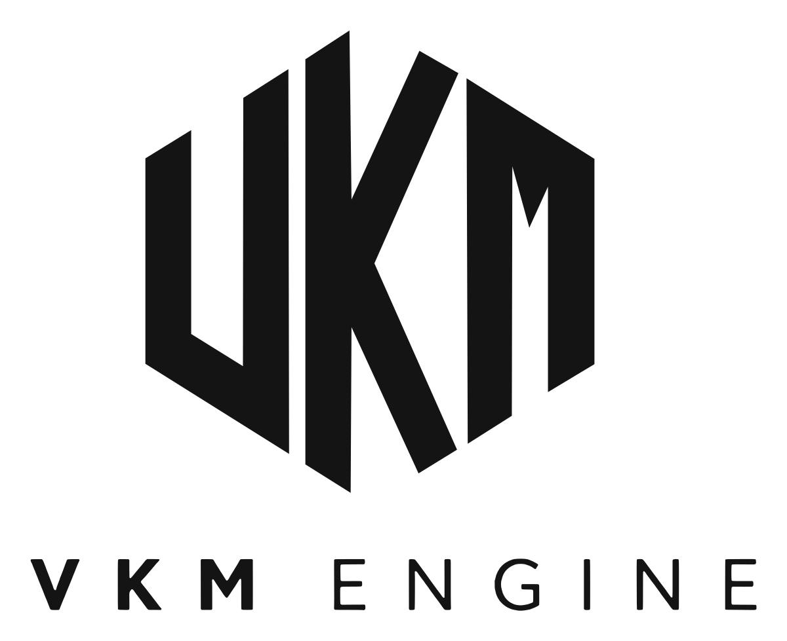
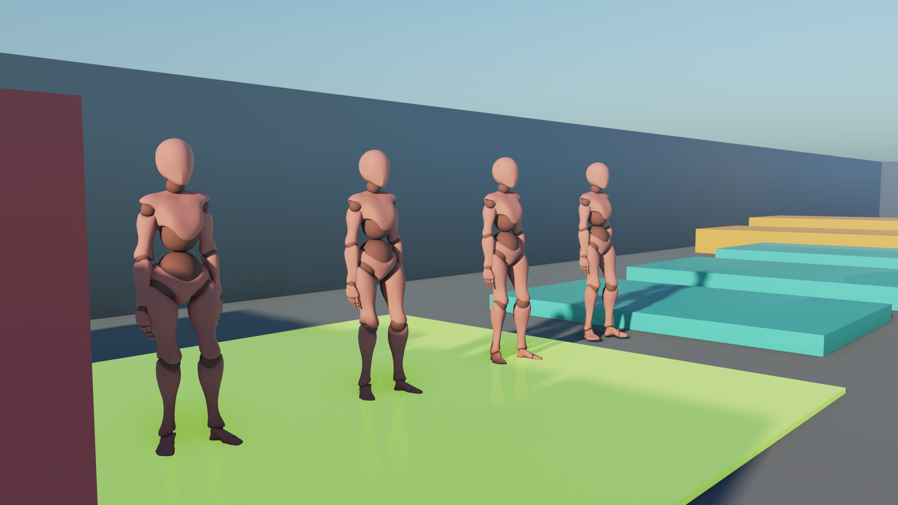
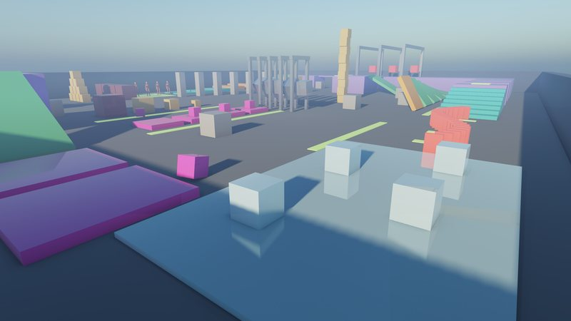
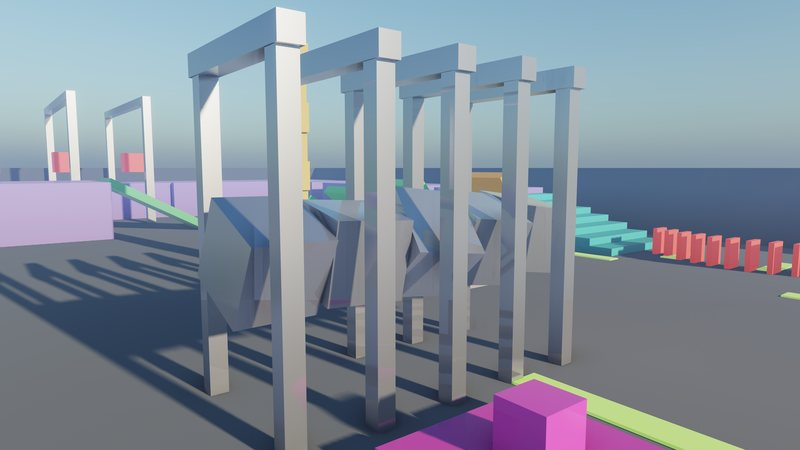
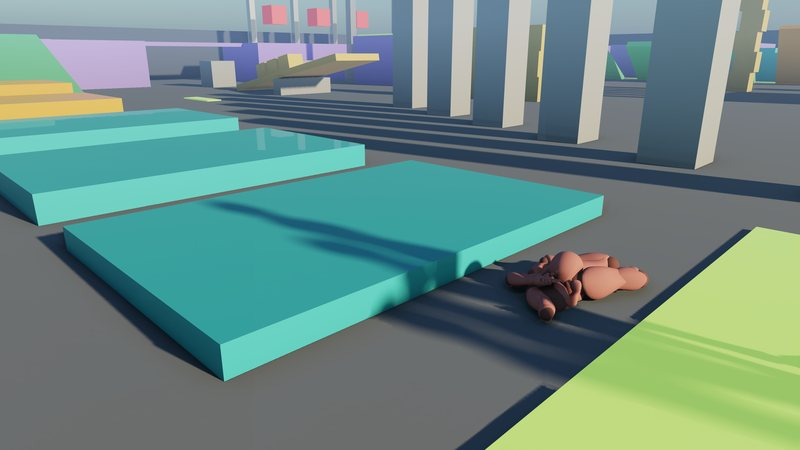
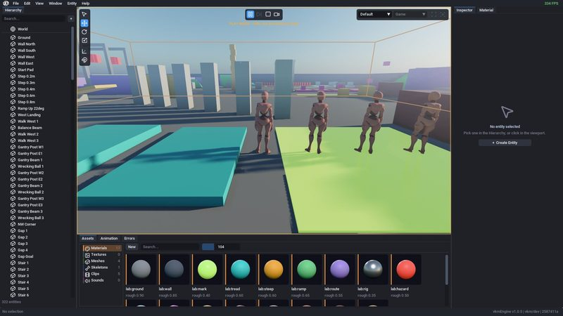
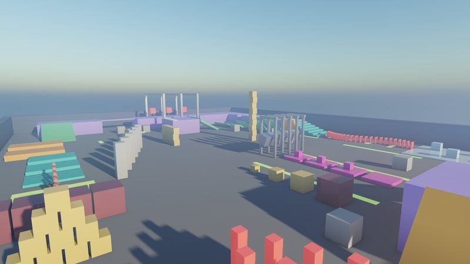
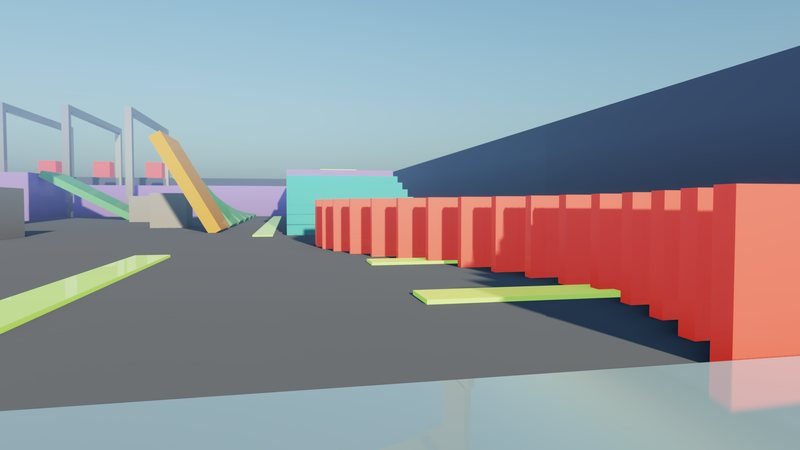
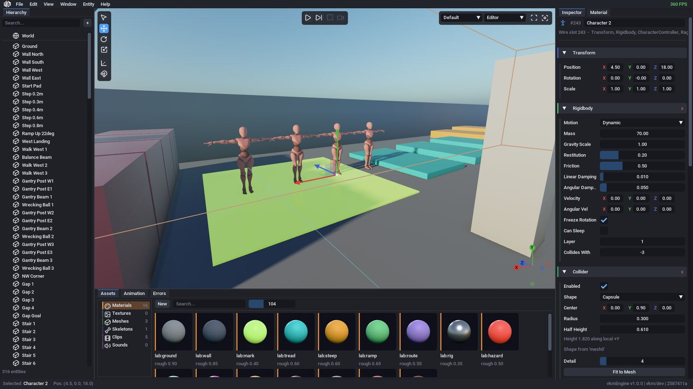

<div align="center">

<picture>
  <source media="(prefers-color-scheme: dark)" srcset="assets/logo/vkm_engine_logo_mono.png">
  
</picture>

<h3>Build games, not engines.</h3>

<p>Everything between your idea and a shipped game is already here.<br>
Write C++ that reloads like a script, runs like native code, and ships with one command.</p>

<p>
  <a href="https://vkmengine.com"><b>Website</b></a> &nbsp;&bull;&nbsp;
  <a href="https://vkmengine.com/docs/"><b>Docs</b></a> &nbsp;&bull;&nbsp;
  <a href="docs/getting-started.md"><b>Getting started</b></a> &nbsp;&bull;&nbsp;
  <a href="CHANGELOG.md"><b>Changelog</b></a>
</p>

<p>
  
  
  
  
  <a href="LICENSE"></a>
</p>



</div>

## Why vkmEngine

<table>
<tr>
<td width="50%" valign="top">

**Gameplay in C++, hot-reloaded**<br>
A game is its own project, and its code is its own module: change it and the editor reloads
it without closing.

</td>
<td width="50%" valign="top">

**Play inside the editor**<br>
Press Play to run the game in the viewport; Stop puts the scene back exactly as it was. Every
edit before that is undoable.

</td>
</tr>
<tr>
<td valign="top">

**Multiplayer built in**<br>
Server-authoritative simulation with client prediction and rollback, on physics that replays
to the bit, and a dedicated server that runs any project.

</td>
<td valign="top">

**Ship in one command**<br>
`vkm package` builds, cooks and hands you the game a player gets. Windows and Linux; OpenGL
today, Vulkan on the roadmap.

</td>
</tr>
</table>

## What's inside

<table>
<tr>
<td width="33%" valign="top">


**Rendering**<br>
<sub>Forward+ clustered lighting, cascaded, spot and cube shadows, area lights, IBL and a
procedural sky, reflection probes, screen-space reflections, GTAO, volumetric fog, decals,
particles, depth of field and bloom.</sub>
</td>
<td width="33%" valign="top">


**Physics**<br>
<sub>Fixed-step rigid bodies over box, capsule and triangle-mesh colliders, a
sequential-impulse solver, joints, collision layers, raycasts and sleeping.</sub>
</td>
<td width="33%" valign="top">


**Characters**<br>
<sub>Skeletal import, GPU skinning, clip blending, bone sockets, ragdolls and a character
controller that takes steps and slides along walls.</sub>
</td>
</tr>
<tr>
<td valign="top">


**The editor**<br>
<sub>A transform gizmo and full undo/redo, Play mode, prefabs with per-instance overrides,
material and render-settings panels, an asset browser and a cooker.</sub>
</td>
<td valign="top">


**Multiplayer**<br>
<sub>Client-server over UDP with snapshot interpolation, lag compensation and
delta-compressed replication. The physics lab is also the multiplayer sample.</sub>
</td>
<td valign="top">


**Core**<br>
<sub>An open ECS over sparse sets, generational handles, a staged system pipeline,
compile-time reflection, a job system, a typed event bus, spatial audio and an in-game UI
with SDF text.</sub>
</td>
</tr>
</table>



## Install

```bash
# Linux
curl -fsSL https://github.com/V-KMilev/vkmEngine/releases/latest/download/install.sh | sh
```

```powershell
# Windows, in PowerShell
irm https://github.com/V-KMilev/vkmEngine/releases/latest/download/install.ps1 | iex
```

No administrator and nothing else to install: the engine brings its own Python, and its first
build fetches the compiler, CMake and Ninja it was built with. Then open **vkmEngine** from your
app menu, or:

```bash
vkm new mygame                   # or: vkm new lab -t physics_lab, a copy of an example
cd mygame
vkm run                          # build, cook and play
vkm package                      # the game a player gets
```

[Getting started](docs/getting-started.md) goes on from there. Every release is also a plain
archive on the [releases page](https://github.com/V-KMilev/vkmEngine/releases), to unpack and use
where it is.

## Building from source

```bash
git clone --recursive https://github.com/V-KMilev/vkmEngine
cd vkmEngine
cmake -B build -G Ninja && cmake --build build
./tools/vkm run examples/physics_lab             # build its module, cook, and play
./build/bin/vkm_editor examples/physics_lab      # or open it in the editor
```

Four executables share one project directory: `vkm_editor` authors it, `vkm_runtime` plays it,
`vkm_cook` bakes its assets, and `vkm_server` serves it to players. `examples/` holds three
complete projects: a physics sandbox that is also the multiplayer sample, an endless runner,
and a stress arena. [Building](docs/reference/building.md) lists the prerequisites, the targets,
and how CI and releases build both SDKs.

## Documentation

The manual lives in [docs/](docs/README.md) and online at
[vkmengine.com/docs](https://vkmengine.com/docs/), with the API reference beside it.

| Using the engine | How it works | Working on the engine |
|---|---|---|
| [ECS](docs/reference/ecs.md) | [Architecture](docs/reference/architecture.md) | [Guides overview](docs/guides/README.md) |
| [Scripting](docs/reference/scripting.md) | [Rendering](docs/reference/rendering.md) | [The engine](docs/guides/engine.md) |
| [Input](docs/reference/input.md) | [Lighting](docs/reference/lighting.md) | [Design](docs/guides/design.md) |
| [UI](docs/reference/ui.md) | [Visibility](docs/reference/visibility.md) | [Implementation](docs/guides/implementation.md) |
| [Physics](docs/reference/physics.md) | [Hierarchy](docs/reference/hierarchy.md) | [Code style](docs/guides/code-style.md) |
| [Audio](docs/reference/audio.md) | [Events](docs/reference/events.md) | [Review](docs/guides/review.md) |
| [Animation](docs/reference/animation.md) | [Resources](docs/reference/resources.md) | [A worked judgment](docs/guides/worked-example.md) |
| [Networking](docs/reference/networking.md) | [Threading](docs/reference/threading.md) |  |
| [IO & serialization](docs/reference/io.md) | [Building](docs/reference/building.md) |  |
| [Editor](docs/reference/editor.md) |  |  |

## Source layout

<details>
<summary>Where everything lives</summary>

```
src/
  engine/          Engine code (single include root: src/engine/)
  backend/opengl/  OpenGL backend (flat gl_-prefixed includes)
  editor/          ImGui editor (command, session, chrome, panels, overlays, input, ui)
  tools/           Asset import, the cooker, the image/font loaders and the host prologue
app/               The four executables + the bootstrap (setupEngineApp) they share
examples/          Complete projects (Potion Runner, Physics Lab, Stress Arena) - gameplay lives here
modules/
  vkmGL            Submodule: GL object wrappers + shader loading (vendors GLEW)
  vkmLog           Submodule: logging + VKM_ASSERT
  glm / glfw / stb Submodules: math, windowing, image + font decode, mip filtering
  miniaudio        Submodule: audio device + wav/mp3/flac decode
  imgui            Submodule: Dear ImGui
  meshoptimizer    Submodule: LOD simplification, GPU vertex order and the import's weld
  freetype / json / tracy
                   Submodules: font rasterization, JSON, profiling
  cgltf / ufbx / mikktspace
                   Submodules: glTF and FBX/OBJ import, and MikkTSpace tangents
  basis_universal  Submodule: the cooker's BC7 encoder, one file of it, cloned shallow
shaders/           GLSL source (one folder per program)
tools/             vkm (the project tool, in vkmcli/), the toolchain it pins, and the installers
assets/            The editor's fonts and logo, and the manual's images; sample art stays local
```

See [Architecture](docs/reference/architecture.md) for the full per-directory breakdown.

</details>

## License

vkmEngine is source-available under the [vkmEngine License](LICENSE). Make games with it and sell
them, free, with no royalty; change the engine for your own games, which ship it compiled. Changes
to the engine itself are shared only as contributions to this repository or in a fork of it on
GitHub - the engine's source, changed or not, is not published or sold anywhere else, and it is
not offered as an engine or toolkit of your own. `vkm package` puts the license and its notice in
every game it builds. The third-party libraries under `modules/` keep their own licenses.
